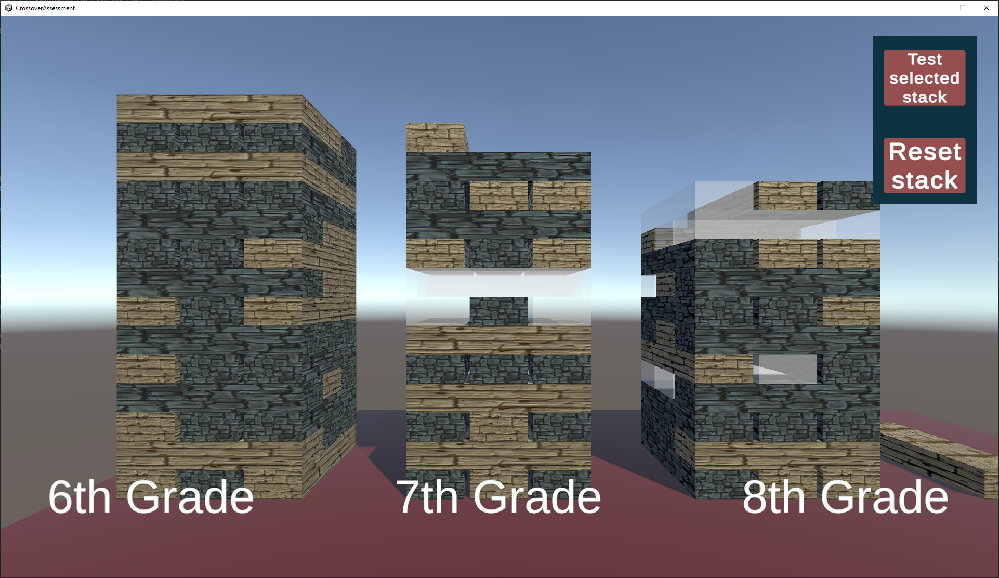

# README

This repository implements the Crossover Unity Game Developer assessment.

## Tech stack

-   Unity 2021.3.23f1 LTS
-   Microsoft Visual Studio Community 2022 (64-bit)

## Platforms supported

-   Windows

## Requirements

Build a 3D Jenga game based on the above concepts and the following requirements:

1. Use this API to fetch data about the Stacks (there are 3 stacks for 3 different grade levels)
2. Put 3 stacks on a table in a row.
    - Use data from the API response to determine the block type:
        - mastery = 0 → Glass
        - mastery = 1 → Wood
        - mastery = 2 → Stone
    - Put a label in front of each stack showing the grade associated with it (e.g., 8th Grade).
    - Order the blocks in the stack starting from the bottom up, by domain name ascending, then by cluster name ascending, then by standard ID ascending.
3. Enable orbit controls on Mouse 1 hold so that the user can rotate the camera around the stack
    - One of the 3 stacks should always be in focus by default.
    - Add some control to switch the view between the 3 stacks.
4. Add an option to get more details about a specific block (e.g., on right-click)
    - Show the following details available in the API response:
        - \[Grade level\]: \[Domain\]
        - \[Cluster\]
        - \[Standard ID\]: \[Standard Description\]
5. Implement the “Test my Stack” game mode described above, where you remove Glass blocks in the selected stack and enable physics.

## Screenshots

